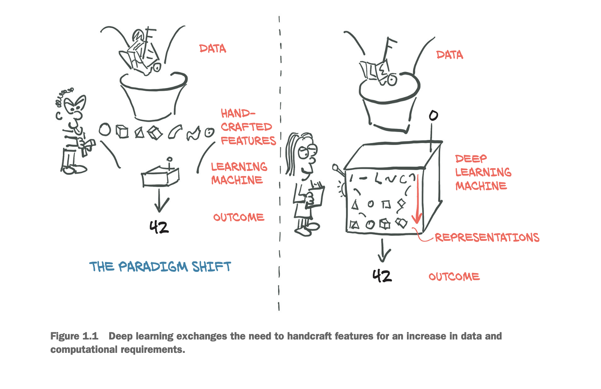

Vicki Boykis in [this article](https://vickiboykis.com/2024/01/15/whats-new-with-ml-in-production/) explain his thoughts about the evolution of ML in production

Some points I noticed. 

- **Machine learning is compression**
- GZIP is compression
- MLP to support compression
- Our current assumptions about ML models and ML Platform(MLP)
    - data : all of our data lives in-house
    - we can update the input data, delete it and we control the filtering mechanisms we apply
    - we live production versions that were A/B tested and that we compare between artifacts
    - we have some leve of explainability
- Moving to LLMs
    - LLM pretraining datasets are MASSIVE. We are no longer working with in-house, specialized data that models our world
    - Whereas traditional machine learning focused on hand-curating
    features, *LLMs work best when we dump all our text data*, into the model and let the layers sort it out.

        

    - LLMs are extremely compute-intensive to train (or pre-train), and fairly easy to fine-tune
    - Metrics and evaluation
        - Traditional models
            - offline : precision, recall, f1, ROC/AUC
            - online : clickthrough rate
            - operational : i/o, model response time, service uptime
        - Because we are now mostly compressing text rather than numerical or heterogeneous features, we suddenly care about also the things above but some others specific to models whose goal is to complete strings of text
            - [Number every LLM dev should know](https://github.com/ray-project/llm-numbers)
            - time to first token
            - tokens per second
    - GPU architectures
        - In tradictional ML, we are used to some tools to handle complex data flow such as apache spark, apache airflow and apache lucene
        - many of these tools were built under the assumptions : we need to coordinate [lots of small pieces of log data](https://newsletter.vickiboykis.com/archive/logs-were-our-lifeblood-now-theyre-our-liability/)
         flowing from our app’s usage servers into a place where it can be aggregated for modeling, so we care about coordination of distributed systems
        - In the world of GPU training and serving, we now have a different problem.
        We need to get everything onto the GPU as fast as possible, so we can process it, because [it’s inefficient to have the GPU idling](https://horace.io/brrr_intro.html), waiting for more data operations.