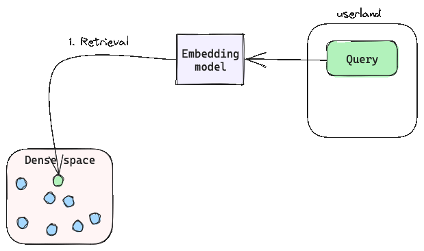

Retrieval Augmented Generation (RAG) is an innovative approach which bridging the gap between traditional information retrieval and language generation. RAG combines two fundamental AI tasks: **information retrieval and text generation**. It's the marriage of these two elements that distinguishes RAG from traditional language models like GPT-3. While conventional language models generate text from scratch based on a given prompt, RAG leverages a retrieval component (vector database for example) to gather relevant information before generating a response.

1. **Retrieval**: The system first searches a vast corpus of documents, databases, or other sources to extract information relevant to the query.
2. **Augmentation**: Once the relevant information is gathered, it's then passed to a text generation model (like GPT-3 or FLAN-T5) The retrieved content augments the generation process by providing context and facts.
3. **Generation**: The text generation model takes the retrieved information and the original query to generate a coherent and contextually appropriate response.

